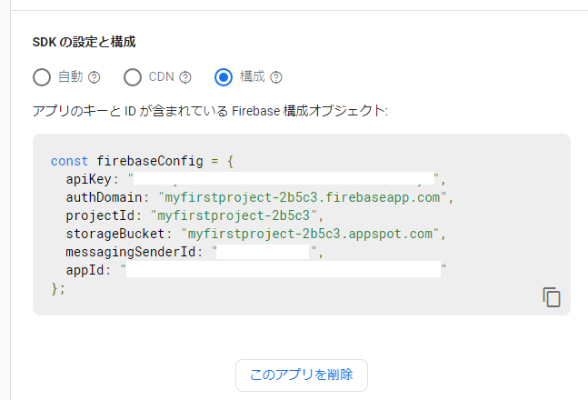

# リアルタイムなLine風チャットアプリ(React + Firestore)

[github firebase-realtime-chat1](https://github.com/murasuke/firebase-realtime-chat1)
## はじめに

* 画面イメージ

  

* Line風のチャットアプリです(複数人の投稿がリアルタイムに更新されます)
* 利用のためには[Firestore](https://firebase.google.com/)アカウントが必要です(googleのアカウントがあれば利用できます)
* 初回利用時に名前を入力すると保存されます
* バックエンドのロジックはありません(DBとして利用するFirestoreの同期機能を利用)
* React + firebaseのSDKを利用します


## 利用モジュール

create-react-app ＋ firebase のSDKのみです。

```json
  "dependencies": {
    "@types/node": "^12.0.0",
    "@types/react": "^17.0.0",
    "@types/react-dom": "^17.0.0",
    "firebase": "^8.8.0",
    "react": "^17.0.2",
    "react-dom": "^17.0.2",
    "react-scripts": "4.0.3",
    "typescript": "^4.1.2"
  }
```

## Firestoreについて

[Firebase](https://firebase.google.com/?hl=ja)とは、Google が提供しているモバイル、Webアプリ向けのバックエンドサービスです。Firestoreというリアルタイムで同期ができるNoSQLデータベースを利用します。


Firebaseプロジェクトの作成方法は下記の外部ページでご確認ください。

[[Firebase] プロジェクトを新規に作成する](https://blog.katsubemakito.net/firebase/firebase-make-newproject)


### Firestore接続設定

`.env`ファイルで設定します。

設定する内容はfirebaseのコンソールから確認します。
  
  

* .env

```bash
#Firebase configuration
REACT_APP_API_KEY=XXXXXXXXXXXXXXXXXXX
REACT_APP_AUTH_DOMAIN=myfirstproject-2b5c3.firebaseapp.com
REACT_APP_PROJECT_ID=myfirstproject-2b5c3
REACT_APP_STORAGE_BUCKET=myfirstproject-2b5c3.appspot.com
REACT_APP_MESSAGEING_SENDER_ID=XXXXXXXXXXXXXXXXXXX
REACT_APP_APP_ID=XXXXXXXXXXXXXXXXXXX
```


* firebaseConfig.ts

Firebase SDKの初期化を行い`db`をエクスポートします。

```typescript
import firebase from 'firebase';

const firebaseConfig = {
  apiKey: process.env.REACT_APP_API_KEY,
  authDomain: process.env.REACT_APP_AUTH_DOMAIN,
  projectId: process.env.REACT_APP_PROJECT_ID,
  storageBucket: process.env.REACT_APP_STORAGE_BUCKET,
  messagingSenderId: process.env.REACT_APP_MESSAGEING_SENDER_ID,
  appId: process.env.REACT_APP_APP_ID,
};

const firebaseApp = firebase.initializeApp(firebaseConfig);
const db = firebaseApp.firestore();
const auth = firebaseApp.auth();

export { auth };
export default db;
```


## ソースコード

Line風の見た目は[CSSだけでLINE風の「吹き出し」を作る方法](https://stand-4u.com/css/fukidashi.html)を参考にさせていただきました。

### html部分

チャットログは`ChatLog`型の配列です。自分の名前のログを右側に、他人を左側に表示するようにclass名を切り替えています。

```typescript
type ChatLog = {
  key: string,
  name: string,
  msg: string,
  date: Date,
};
```
* Chat1.tsx

```typescript
<>
  {/* チャットログ */}
  <div>      
    {chatLogs.map((item, i) => (
      <div className={userName===item.name? 'balloon_r': 'balloon_l'} key={item.key}>
        {userName===item.name? getStrTime(item.date): '' }
        <div className="faceicon">
          
        </div>
        <div style={{marginLeft: '3px'}}>
          {item.name}<p className="says">{item.msg}</p>
        </div>
        {userName===item.name? '': getStrTime(item.date)}
      </div>
    ))}
  </div>
  
  {/* メッセージ入力 */}
  <form className='chatform' onSubmit={e => { submitMsg();e.preventDefault() }}>
    <div>{userName}</div>       
      <input type="text" value={msg} onChange={(e) => setMsg(e.target.value)} />
      <input type='image' onClick={submitMsg} src='./img/airplane.png' alt='' />       
  </form>
</>
```


### データ同期処理

簡略化のため保存するテーブル名(collection)は固定です。

チャットルームのリファレンス(`messagesRef`)を取得して、最新10件を取得します。

`onSnapshot()`で変更イベントを受け取ります。別の人が追加したチャットメッセージを受け取り、ログに追加します。

   * 削除、更新イベントも発生しますが、動作に影響ないため追加のみを処理します。

```typescript
  const [chatLogs, setChatLogs] = useState<ChatLog[]>([]);
  const messagesRef = useMemo(() => db.collection("chatroom").doc("room1").collection("messages"), []);

  useEffect( () => {
    // 同期処理イベント（最新10件をとるためdateでソート)
    messagesRef.orderBy("date", "desc").limit(10).onSnapshot((snapshot) => {
      snapshot.docChanges().forEach((change) => {
        if (change.type === "added") {
          // チャットログへ追加
          addLog(change.doc.id, change.doc.data());
          // 画面下部へスクロール
          window.scroll(0, document.documentElement.scrollHeight - document.documentElement.clientHeight)
        }
      });
    });
  },[]);
```

### チャットメッセージ追加処理

```typescript
  /**
   * チャットログに追加
   */
  function addLog(id: string, data: any) {
    const log = {
      key: id,
      ...data,
    };
    // Firestoreから取得したデータは時間降順のため、表示前に昇順に並び替える
    setChatLogs((prev) => [...prev, log,].sort((a,b) => a.date.valueOf() - b.date.valueOf()));
  }
```

## ソースコード全体

```typescript
import React, {useState, useMemo, useEffect} from 'react';
import db from './firebaseConfig';
import './chat1.css';

type ChatLog = {
  key: string,
  name: string,
  msg: string,
  date: Date,
};


/**
 * ユーザー名 (localStrageに保存)
 **/
const getUName = (): string =>  {
  const userName = localStorage.getItem('firebase-Chat1-username');
  if (!userName) {
    const inputName = window.prompt('ユーザー名を入力してください', '');
    if (inputName){
      localStorage.setItem('firebase-Chat1-username', inputName);
      return inputName;
    }    
  }
  return userName;
}

/**
 * UNIX TIME => hh:mm
 **/
function getStrTime(time: any){
  let t = new Date(time);
  return `${t.getHours()}`.padStart(2, '0') + ':' + `${t.getMinutes()}`.padStart(2, '0');
}


/**
 * チャットコンポーネント(Line風)
 */
const Chat1: React.FC = () => {
  const [chatLogs, setChatLogs] = useState<ChatLog[]>([]);
  const [msg, setMsg] = useState('');
  const userName = useMemo(() => getUName(), []);
  const messagesRef = useMemo(() => db.collection("chatroom").doc("room1").collection("messages"), []);

  useEffect( () => {
    // 同期処理イベント（最新10件をとるためdateでソート)
    messagesRef.orderBy("date", "desc").limit(10).onSnapshot((snapshot) => {
      snapshot.docChanges().forEach((change) => {
        if (change.type === "added") {
          // チャットログへ追加
          addLog(change.doc.id, change.doc.data());
          // 画面下部へスクロール
          window.scroll(0, document.documentElement.scrollHeight - document.documentElement.clientHeight)
        }
      });
    });
  // eslint-disable-next-line react-hooks/exhaustive-deps
  },[]);
  
  /**
   * チャットログに追加
   */
  function addLog(id: string, data: any) {
    const log = {
      key: id,
      ...data,
    };
    // Firestoreから取得したデータは時間降順のため、表示前に昇順に並び替える
    setChatLogs((prev) => [...prev, log,].sort((a,b) => a.date.valueOf() - b.date.valueOf()));
  }

  /**
   * メッセージ送信
   */
  const submitMsg = async () => {
    if (msg.length === 0) {
      return;
    }

    messagesRef.add({
      name: userName,
      msg: msg,
      date: new Date().getTime(),
    });

    setMsg("");
  };

  return (
    <>
      {/* チャットログ */}
      <div>      
        {chatLogs.map((item, i) => (
          <div className={userName===item.name? 'balloon_r': 'balloon_l'} key={item.key}>
            {userName===item.name? getStrTime(item.date): '' }
            <div className="faceicon">
              
            </div>
            <div style={{marginLeft: '3px'}}>
              {item.name}<p className="says">{item.msg}</p>
            </div>
            {userName===item.name? '': getStrTime(item.date)}
          </div>
        ))}
      </div>
      
      {/* メッセージ入力 */}
      <form className='chatform' onSubmit={e => { submitMsg();e.preventDefault() }}>
        <div>{userName}</div>       
          <input type="text" value={msg} onChange={(e) => setMsg(e.target.value)} />
          <input type='image' onClick={submitMsg} src='./img/airplane.png' alt='' />       
      </form>
    </>
  );
};

export default Chat1;

```

## 参考ページ
[[Firebase] プロジェクトを新規に作成する](https://blog.katsubemakito.net/firebase/firebase-make-newproject)

[[Firebase] Firestoreで読み書きする (Web編)](https://blog.katsubemakito.net/firebase/firestore_readwrite_1)

[[Firebase] Firestoreでリアルタイムなチャットを作る (Web編) その1](https://blog.katsubemakito.net/firebase/firestore_realtime_1)

[CSSだけでLINE風の「吹き出し」を作る方法](https://stand-4u.com/css/fukidashi.html)